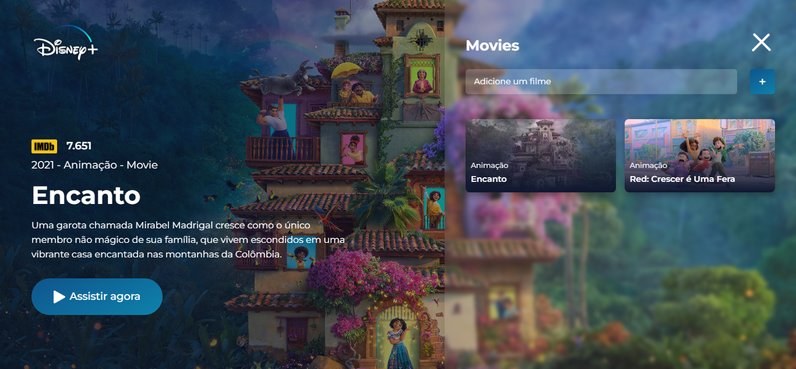

# Projeto Disney Plus

## 💻 _disneyPlus_

Clone da interface do Disney Plus com conteúdo dinâmico utilizando a api do TMDB.

## 💻 Projeto desenvolvido

<a href="https://gabrieldiasdev.github.io/disneyPlus/" target="_blank">Acesse o projeto</a>

## 💡 Info

O projeto contém uma interface moderna e responsiva inspirada na interface do Disney Plus, apresentando informções sobre o filme selecionado, o conteúdo é apresentado dinamicamente por meio da api pública do TMDB ! <a href="https://www.themoviedb.org/documentation/api" target="_blank">Link da api</a>

## 🔨 Funcionalidades

-   Inserção de novos filmes através do id ou link do filme na plataforma IMDB. Ex: Link -> https://www.imdb.com/title/tt11145118/ , Id -> tt11145118
-   Salvamentos dos filmes inseridos pelo usuário através do localStorage.

## 💻 Tecnologias/Pacotes utilizados

**Frontend**

-   Html
-   Css
-   Javascript
-   LocalStorage
-   TMDB

## 👨‍💻 Autor

Gabriel Dias Catarin, desenvolvedor web | Bauru, São Paulo

[ LinkedIn](https://www.linkedin.com/in/gabriel-dias-260857207/)
&nbsp;
